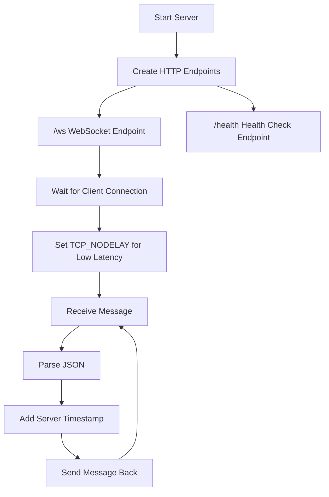
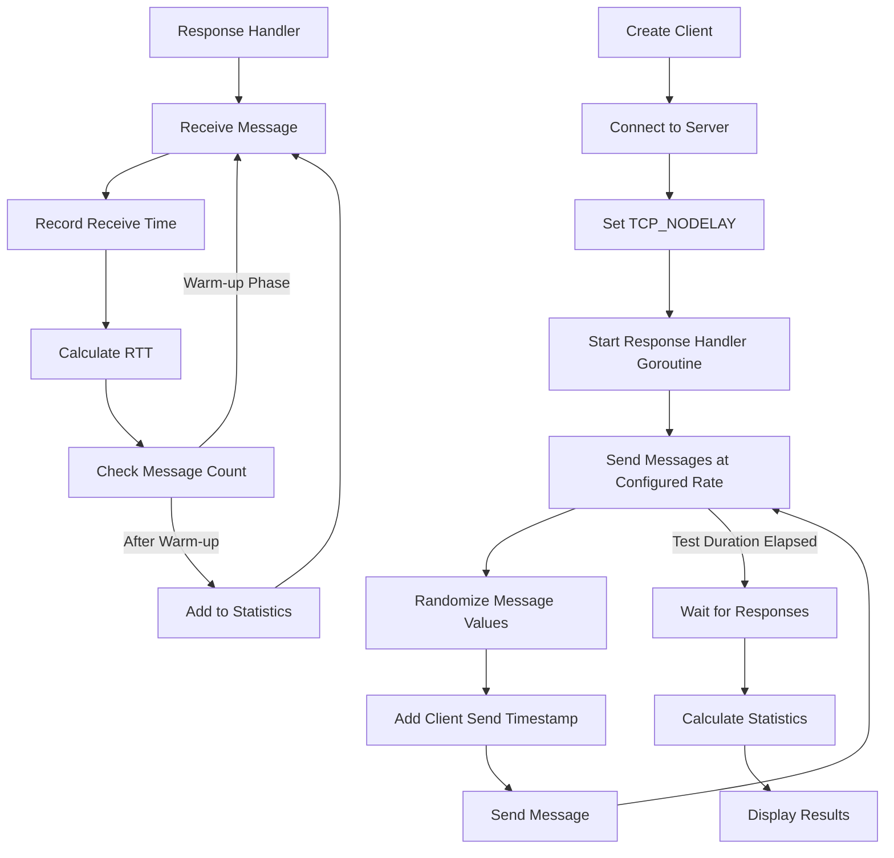
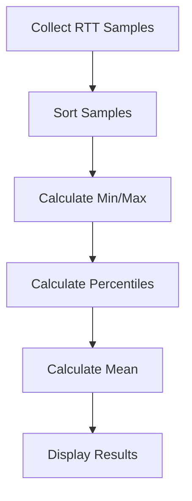

# WebSocket Latency Test Application (Go Implementation)

A high-performance WebSocket latency testing tool written in Go. This application measures the round-trip time (RTT) between a WebSocket client and server with precise microsecond timing.

## Features

- WebSocket server and client in a single application
- Dedicated health check endpoint for monitoring and load balancer integration
- Configurable message rate (messages per second)
- Configurable test duration
- Warm-up phase with configurable message count to exclude initial connection overhead
- Detailed latency statistics (min, max, P10, P50, P90, P99, mean)
- Low-latency optimizations (TCP_NODELAY, etc.)
- Random message generation with consistent byte size
- Client IP address logging (both HTTP and TCP client IPs)

## Code Logic

The application follows a modular design with three main packages:

### 1. Server Logic (`pkg/server/server.go`)



- The server creates a WebSocket endpoint at `/ws` and a health check endpoint at `/health`
- When a client connects:
  - Logs both HTTP and TCP client IP addresses
  - Sets `TCP_NODELAY` to disable Nagle's algorithm for lower latency
- For each message received:
  - Parses the JSON message
  - Adds a server timestamp to the `_test` field using `processMessage` method
  - Sends the message back to the client without any other processing
- The server is designed to handle multiple concurrent connections efficiently

### 2. Client Logic (`pkg/client/client.go`)



- The client connects to the WebSocket server and sets `TCP_NODELAY` for lower latency
- It creates a base message template with cryptocurrency exchange ticker-like structure
- A goroutine handles incoming responses asynchronously
- The main loop sends messages at a configurable rate for a configurable duration:
  - Randomizes message values to simulate real data
  - Adds a client send timestamp in microseconds
  - Sends the message to the server
- When a response is received:
  - Records the receive time in microseconds
  - Calculates RTT as `client_recv_ts_us - client_send_ts_us`
  - During the warm-up phase, messages are processed but not included in statistics
  - After the warm-up phase, RTT values are added to the statistics collection
- After the test completes, it calculates and displays statistics, noting how many messages were skipped for warm-up

### 3. Statistics Logic (`pkg/stats/stats.go`)



- Collects round-trip time samples in microseconds
- Calculates various statistics:
  - Minimum and maximum RTT
  - Percentiles (P10, P50, P90, P99)
  - Mean RTT

### Message Format and RTT Calculation

The application uses a JSON message format with a special `_test` field for timestamps:

```json
{
  "arg": {"channel":"tickers","instId":"BTC-USDC"},
  "data": [...],
  "_test": {
    "client_send_ts_us": 1747721466604123,  // Client send timestamp (microseconds)
    "server_ts_us": 1747721466604200,       // Server processing timestamp (microseconds)
    "client_recv_ts_us": 1747721466604300   // Client receive timestamp (microseconds)
  }
}
```

The RTT calculation is:
```
RTT = client_recv_ts_us - client_send_ts_us
```

### Performance Optimizations

1. **Network Optimizations**:
   - `TCP_NODELAY` is set to disable Nagle's algorithm, which prevents small packets from being combined before sending, reducing latency
   - WebSocket connections are kept open for the duration of the test to avoid connection establishment overhead

2. **Memory Optimizations**:
   - Pre-allocation of buffers and slices (e.g., `stats.Samples` is pre-allocated with the expected capacity)
   - Reuse of message templates (the base message structure is created once and then modified)

3. **Timing Precision**:
   - Timestamps are recorded in microseconds using `time.Now().UnixNano() / 1000`
   - The application uses Go's high-resolution timer for accurate measurements

## Project Structure

```
ws-latency-app-golang/
├── cmd/
│   └── ws-latency-test/
│       └── main.go      # Main application entry point
├── pkg/
│   ├── client/
│   │   └── client.go    # WebSocket client implementation
│   ├── server/
│   │   └── server.go    # WebSocket server implementation
│   └── stats/
│       └── stats.go     # Latency statistics calculation
├── Makefile             # Build automation
├── go.mod               # Go module file
└── .gitignore           # Git ignore file
```

## Requirements

- Go 1.16 or higher
- [Gorilla WebSocket](https://github.com/gorilla/websocket) package

## Installation

1. Clone this repository:
   ```
   git clone https://github.com/yourusername/ws-latency-lab.git
   cd ws-latency-lab/ws-latency-app-golang
   ```

2. Install dependencies and build the application using the Makefile:
   ```
   make deps
   make build
   ```
   
   Alternatively, you can do it manually:
   ```
   go mod tidy
   go build -o ws-latency-app ./cmd/ws-latency-test
   ```

## Using the Makefile

The project includes a Makefile with several useful targets:

```
make              # Build the application (same as 'make build')
make build        # Build the application
make build-all    # Build for multiple platforms
make test         # Run tests
make server       # Build and run the server
make client       # Build and run the client
make run-test     # Run automated test
make clean        # Remove build artifacts
make clean-logs   # Remove log files
make deps         # Install dependencies
make help         # Show this help message
```

## Usage

### Running the Server

```bash
./ws-latency-app -mode=server [-port=8080]
```

The server will log client connections with both HTTP and TCP client IP addresses:
```
2025/08/04 08:45:12 Client connected - HTTP IP: 127.0.0.1, TCP IP: 127.0.0.1
```

Options:
- `-port`: Port for the server to listen on (default: 8080)

### Running the Client

```bash
./ws-latency-app -mode=client [-server=ws://localhost:8080/ws] [-rate=10] [-duration=30] [-prewarm-count=100] [-insecure] [-continuous]
```

Options:
- `-server`: WebSocket server URL (default: ws://localhost:8080/ws)
- `-rate`: Messages per second (default: 10)
- `-duration`: Test duration in seconds (default: 30)
- `-prewarm-count`: Skip calculating RTT for first N messages (default: 100)
- `-insecure`: Skip TLS certificate verification (not recommended for production)
- `-continuous`: Run in continuous monitoring mode (ignores duration)

## Automated Testing

A shell script is provided to automate the testing process:

```bash
./test.sh
```

Options:
- `-p, --port PORT`: Server port (default: 8080)
- `-r, --rate RATE`: Messages per second (default: 100)
- `-d, --duration SEC`: Test duration in seconds (default: 10)

Example:
```bash
./test.sh --port 9000 --rate 200 --duration 30
```


## Test Results

Example test results at different message rates:

1. **50 messages/second**:
   - Min RTT: 53 µs
   - Median RTT: 86 µs
   - P90 RTT: 127 µs
   - P99 RTT: 204 µs
   - Max RTT: 219 µs
   - Mean RTT: 90.93 µs

2. **200 messages/second**:
   - Min RTT: 48 µs
   - Median RTT: 63 µs
   - P90 RTT: 89 µs
   - P99 RTT: 176 µs
   - Max RTT: 594 µs
   - Mean RTT: 70.38 µs

## Unit Testing

The application includes comprehensive unit tests for all major components:

```bash
# Run all tests
go test ./...

# Run tests for a specific package
go test ./pkg/stats
go test ./pkg/server
go test ./pkg/client
```

The test suite includes:

- **Stats Package Tests**: Tests for statistical calculations and percentile functions
- **Server Package Tests**: Tests for WebSocket server functionality, message processing, and error handling
- **Client Package Tests**: Tests for client operations, message handling, and connection management

The tests use mocking techniques to simulate WebSocket connections without requiring actual network communication, making them fast and reliable.

## Health Check Endpoint

The WebSocket server includes a dedicated health check endpoint at `/health` that returns a JSON response with the server's status and current timestamp:

```json
{"status":"healthy","timestamp":"2025-05-23T08:01:55Z"}
```

This endpoint is designed for:
- Load balancer health checks (e.g., AWS ALB)
- Monitoring systems
- Manual server status verification

### Using the Health Check Script

A helper script is provided to check the health of the WebSocket server:

```bash
./health_check.sh [host] [port]
```

Options:
- `host`: The hostname or IP address of the server (default: localhost)
- `port`: The port number of the server (default: 10443)

The script provides:
1. Basic health check (JSON response)
2. HTTP status code check
3. Detailed health check with headers
4. Parsed health information
5. Continuous monitoring option

Example:
```bash
# Check local server
./health_check.sh

# Check remote server
./health_check.sh server-ip 10443

# Check through ALB
./health_check.sh alb-dns-name 8443
```

## Performance Optimization

For best results:

1. Run server and client on the same machine for minimal network overhead
2. Increase process priority
3. Pin processes to specific CPU cores
4. Disable CPU frequency scaling
5. Consider using a real-time kernel
